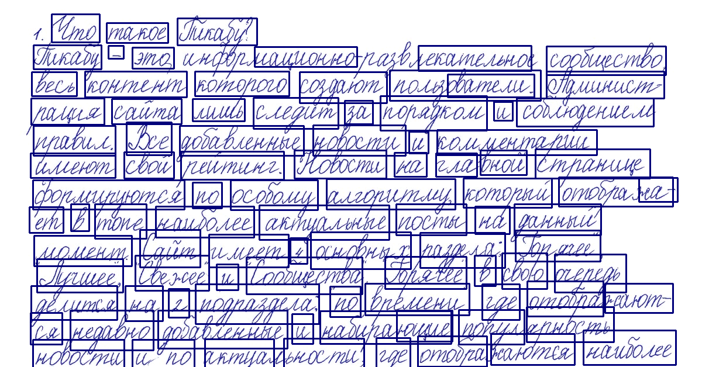

# Распознование русского рукописного текста | RussianHTR
Распознавание русского рукописного текста

## Детекция слов, сортировка
Output:

## Распознование слов
Output: `Что такое Тикабу? Тикабу т. это национно екательно созбщество весь контент которого создают пользователи ватели Админист- рация сайта лишь следит за порядком и соблюдением правил. Все добавленные новости и комментарии имеют свой ректин
г. Новости на гла Оной Странице формируются по особому алгоритму который отобража ха- ет в топе наиболее актуальные посты на данный лизмент дит Имеет 4 оснувных разделд. борячее Пучшее, вежее И Сообщества Прячее в свою очередь делится
на 2 подраздела. по времени где отобра жают- ся недавно добавленные И набирающие ющие попул арность новости и по актуа оности, где отобра наются наиболее`

## Исправление ошибок
Output: `Что такое Тикабу? Тикабу - это национальное, творческое сообщество, весь контент которого создают пользователи и читатели. Администрация сайта лишь следит за порядком и соблюдением правил. Новости на главной странице формируются по особому алгоритму, который отображает в топе наиболее актуальные посты. На данный момент сайт имеет 4 основных раздела: «Горячее», «лучшее», «Веге» и «Сообщества». «Горячее», в свою очередь, делится на 2 подраздела: по времени, где отображ
аются недавно добавленные и набирающие популярность новости, и по актуальности, где отображаются наиболее актуальные.`
